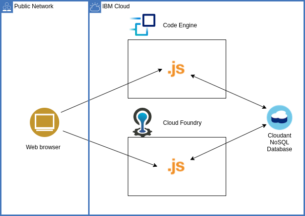

# Migrating an app from Cloud Foundry to IBM Cloud Code Engine
This repository contains a code and instructions for a simple but typical "getting started" web app. It is written in Node.js (JavaScript) and uses the [Express web framework](https://expressjs.com/). An [IBM Cloudant NoSQL database](https://www.ibm.com/cloud/cloudant) serves as [backing service](https://12factor.net/backing-services) to store data displayed by the app. As typical for cloud native /12 twelve factor apps, the sample solution is based on discrete, reusable components which act as microservices to make up the overall app. Both the deployed Node.js program as well as the database can be scaled, improved or even replaced independently. They work together because of how they are [configured](https://12factor.net/config) and by using well-defined APIs.

Thus, the Cloudant database can be configured to work as attached resource with the app versions deployed to Cloud Foundry and Code Engine. This is shown in the architecture diagram below. The solution is kept to these two components for simplicity.

### Structure
Three branches:
- [1cloudfoundry_base](https://github.com/IBM-Cloud/CloudFoundry-to-CodeEngine/tree/1cloudfoundry_base) holds the Cloud Foundry version of the code. It can only be deployed to Cloud Foundry.
- [2cf_ce_intermediate_hybrid](https://github.com/IBM-Cloud/CloudFoundry-to-CodeEngine/tree/2cf_ce_intermediate_hybrid) is the branch for a hybrid code version. The code supports deployment to both Cloud Foundry and Code Engine runtime environments. It could be used while running the app in both environments during the transition phase. The app could be enhanced and bugs fixed regardless of the actual runtime environment.
- [3codeengine_target](https://github.com/IBM-Cloud/CloudFoundry-to-CodeEngine/tree/3codeengine_target) has the code after the migration. It only supports deployment to IBM Cloud Code Engine.

# Resources

- IBM Cloud documentation: [Migrating Cloud Foundry applications to Code Engine](https://cloud.ibm.com/docs/codeengine?topic=codeengine-migrate-cf-ce-tutorial)
- [Cloud Foundry vs. Code Engine terminology](terminology.md)
- [A comparison of Cloud Foundry and Code Engine CLI commands](cli_commands.md)